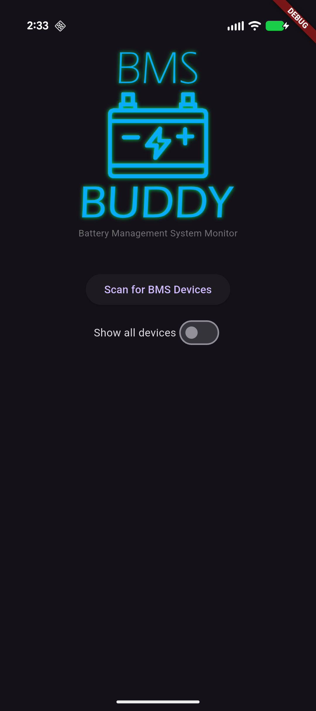
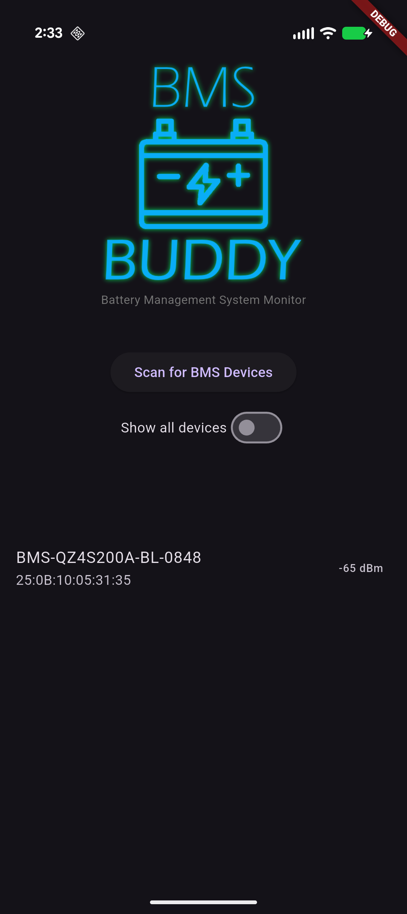
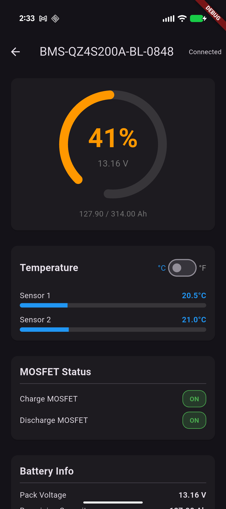
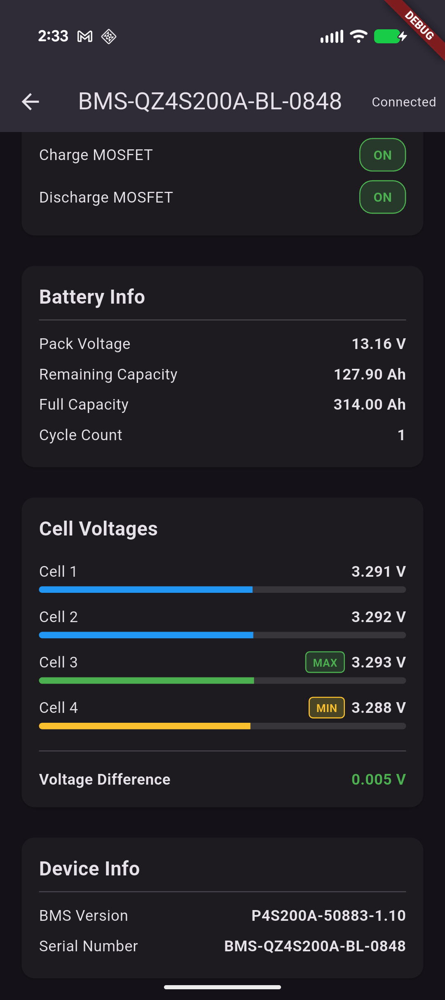

# BMS Buddy

A cross-platform Battery Management System monitor for Dumfume Bluetooth-enabled LiFePO4 batteries.

## Features

- **Bluetooth Scanning** - Automatically discovers BMS devices nearby
- **Real-time Monitoring** - Live updates of battery status every 3 seconds
- **State of Charge** - Visual gauge showing battery percentage and voltage
- **Temperature Sensors** - Monitor battery and MOSFET temperatures (C/F toggle)
- **Cell Voltages** - Individual cell monitoring with min/max indicators
- **MOSFET Status** - View charge/discharge MOSFET states
- **Device Info** - BMS version and serial number

## Screenshots

| Scan Screen | Device Found | Battery Status | Cell Details |
|-------------|--------------|----------------|--------------|
|  |  |  |  |

## Downloads

### Android
- [bms_buddy_v0.6.apk](Android/bms_buddy_v0.6.apk) - Direct install APK

### Windows
- [Windows/](Windows/) - Windows executable and dependencies

## Installation

### Android
1. Download the APK file
2. Enable "Install from unknown sources" if prompted
3. Open the APK to install

### Windows
1. Download the entire Windows folder
2. Run `bms_monitor.exe`

## Compatibility

May work with others, but built for and tested on a Dumfume LiFePO4 battery.

If you aren't sure if your battery has the Bluetooth BMS, use your phone to scan for Bluetooth devices.

If you see a device that starts with "BMS-" then you should be good to go!

## Permissions Required

- **Bluetooth** - To scan and connect to BMS devices
- **Location** - Required by Android for Bluetooth scanning

## License

This software is provided as-is for personal use.
